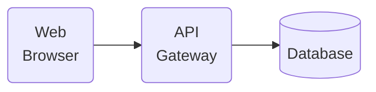

Draw diagrams(System Architecture, Sequence Diagram, Flowcharts)  for {system/topic or attach files like code} in Mermaid with a clean, modern style similar to Google Docs.  
The diagrams must be parser-safe for draw.io / Confluence Mermaid editor.

⚠️ Error-avoidance rules (very important):

1. One edge per line – never merge multiple edges in the same line.  
2. No semicolons `;` in flowchart syntax (old engines don’t support it).  
3. No spaces around arrows: use `A-->B` (❌ not `A --> B`).  
4. Do NOT use quotes `"..."` directly in edge labels (parser will fail).  
   - If a label has spaces or special characters, create a separate **label node** instead:  
     ```
     A-->L_https
     L_https["HTTPS"]
     L_https-->B
     ```
5. Node IDs must be alphanumeric or underscore only.  
6. Node text must go inside `[ ]` or `( )`.  
   - If the text contains special characters like `:`, wrap it in `["..."]`.  
7. Always separate the node declarations block and the edges block with a blank line or `%%__EDGES__`.  
8. Keep shapes simple:  
   - `[ ]` for processes/services  
   - `( )` for rounded/actors  
   - `[( )]` for storage/databases  
9. For long text, use `<br>` line breaks.
10. Avoid parentheses in text when using `( )` shaped nodes.
11. Use `_` instead of `/` or parentheses in node text.
12. Fix broken quote nodes → use `ID["Text"]`.
🎨 Always prepend this **Google Docs style theme block**:

```mermaid
%%{init: {'theme':'base','themeVariables':{
  'fontFamily':'-apple-system, "SF Pro Text", "SF Pro Display", BlinkMacSystemFont, "Segoe UI", Roboto, "Helvetica Neue", Helvetica, Arial, system-ui, sans-serif',
  'fontSize':'12px',

  /* iOS Light palette */
  'mainBkg':'#FFFFFF',
  'primaryColor':'#FFFFFF',
  'secondaryColor':'#FFFFFF',
  'tertiaryColor':'#FFFFFF',

  /* Text & separators */
  'textColor':'#111111',
  'nodeTextColor':'#111111',
  'primaryTextColor':'#111111',
  'lineColor':'#C6C6C8',               /* iOS separator gray */
  'edgeLabelBackground':'#F2F2F7',     /* iOS grouped table bg */

  /* Borders & accents */
  'primaryBorderColor':'#0A84FF',      /* iOS system blue */
  'secondaryBorderColor':'#D1D1D6',    /* secondary separator */
  'tertiaryBorderColor':'#E5E5EA',

  /* Clusters (cards/groups) */
  'clusterBkg':'#FFFFFF',
  'clusterBorder':'#D1D1D6',

  /* Status colors (iOS system) */
  'errorColor':'#FFF2F2',
  'errorBorderColor':'#FF3B30',
  'tertiaryColorHighlight':'#34C759',  /* success accent bg hint */

  /* Shape */
  'nodeBorderRadius':12,
  'padding':'10'
}}}%%
```

---

### Example (minimal diagram):


